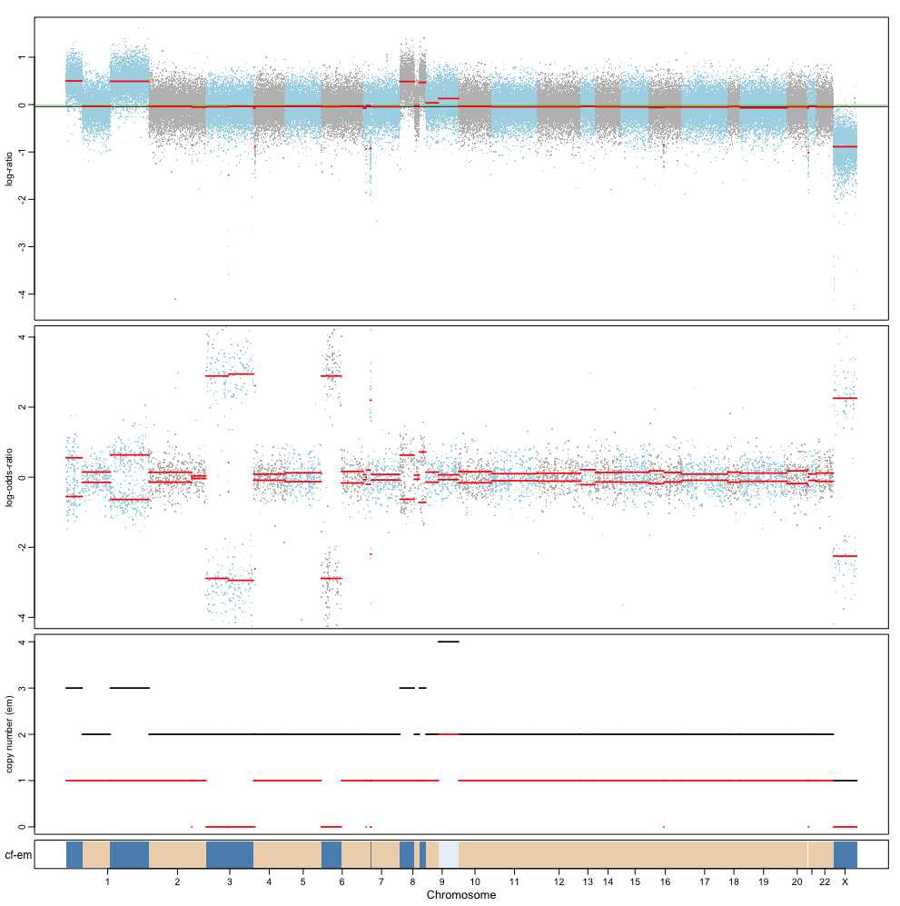

# 2016-12-01
Allele-specific copy number analysis of tumors

In [R](https://www.rstudio.com/):

Install FACETS:
```
install.packages("devtools")
devtools::install_github("mskcc/pctGCdata")
devtools::install_github("mskcc/facets", build_vignettes = TRUE)
```

Then run the example script `facets_example.R`


